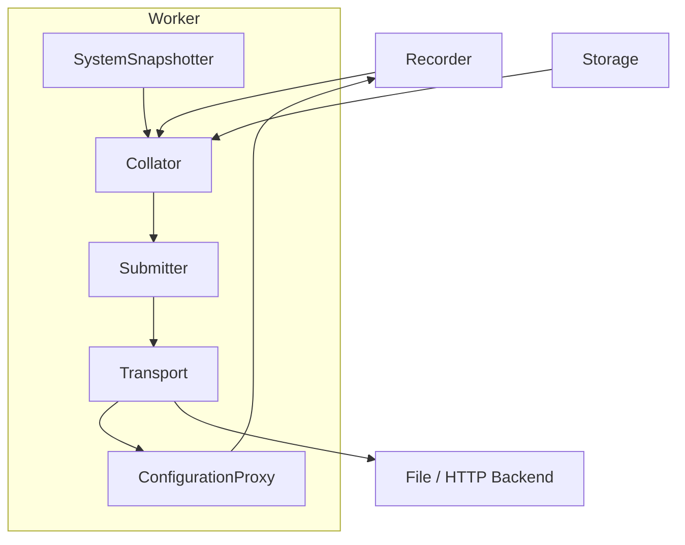

# detsys-ids-client

A client for `install.determinate.systems`, in particular the feature flagging/configuration and event collection.
The event collection data is explicitly PostHog compatible.

The collected properties are not identifying.
You can see our privacy policy at https://determinate.systems/policies/privacy/.

### Architecture

Components:

- **Recorder** is the user-interface and cheap to clone, doing all the work over channels.
- **Storage** models persistent storage between executions, which may be a no-op in-memory implementation.
- **ConfigurationProxy** reads configuration and feature properties from the **Transport**.
- **Collator** fetches a recent **SystemSnapshot** from the **SystemSnapshotter** and agggregates the total sum of facts and event data to enrich the basic event data from the **Recorder**. Those events are then sent to the **Submitter**.
- **SystemSnapshotter** produces a fresh **SystemSnapshot** of the host. This may include properties that change frequently, like thermal state, so a SystemSnapshot must not be reused.
- **Submitter** batches and sends events over the **Transport** on a schedule, or when the **Recorder** explicitly requests an immediate flush.
- **Transport** handles the actual reading of configuration and writing of event data.

### Transports

- **SrvHttp**: The default if no endpoint is specified (ie: None is passed).
  The provided endpoint record will be queried for SRV records.
  Each server in the record will be used in rotation, and for fallback if the backend is not behaving.
  Beyond that, it behaves like the HTTP transport.

- **File**: Will try to parse the endpoint as-is, or with `file://` prefixed on it.
  With the File endpoint, the `DETSYS_IDS_CHECKIN_FILE` environment variable can point to a check-in configuration document to read.
  **Note:** You can pass an endpoint of `file:///dev/stdout` for interactive debugging.

- **HTTP**: takes the configured `endpoint` and sets the URL path to `/check-in` for the checkin process, and `/events` for event submission.

### Environment Variables

- `DETSYS_CORRELATION` -- A JSON blob that is set by `detsys-ts` and passes down some anonymized context about the GitHub Actions run. It can also contain an arbitrary set of event properties.
- `DETSYS_IDS_CHECKIN_FILE` -- When using the File transport, this environment variable can point to a Checkin-compatible JSON file to specify features and options.
- `DETSYS_IDS_IN_CI` -- Set to `1` to explicitly indicate this run is in CI.
- `DETSYS_IDS_TELEMETRY` -- set to `disabled` to turn off telemetry.
- `DETSYS_IDS_TRANSPORT` -- Defaults to using the SrvHttp method, but set to `file:///....` to write IDS event data to a file.

The correlation data is mixed in to the event data by the Collator, and:

- `$session_id` is preferred over generating a new one.
- `$anon_distinct_id` is preferred over generating a new one.
- `distinct_id` is used if the user of the library doesn't explicitly pass a distinct ID.
- `$device_id` is used instead of generating a new one if the user doesn't explicitly pass a device ID.
- `$groups` is merged in to the user-provided groups.
- Any additional property is appended to the user-provided facts.

Note that `$anon_distinct_id`, `distinct_id`, and `$device_id` are disregarded if the Storage implementation has stored properties available.

### Files

- `/var/lib/determinate/identity.json` -- Contains correlation data that is provided by an external tool.
  This library only reads this file for aiding with feature flagging support.

### To-do

- Rotate sessions after inactivity: https://github.com/PostHog/posthog-ios/blob/35d7b9306ae932da869a8c1fcadf2232494a5e71/PostHog/PostHogSessionManager.swift#L57-L69
- send-receive ZSTD data
